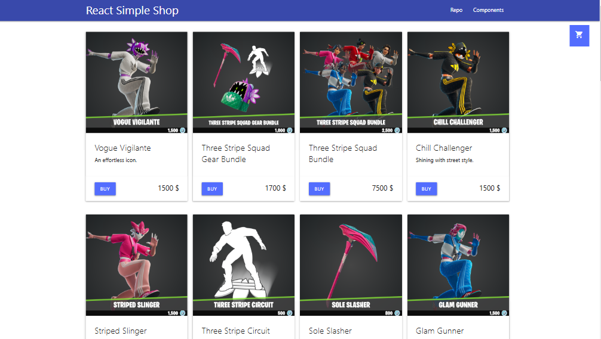
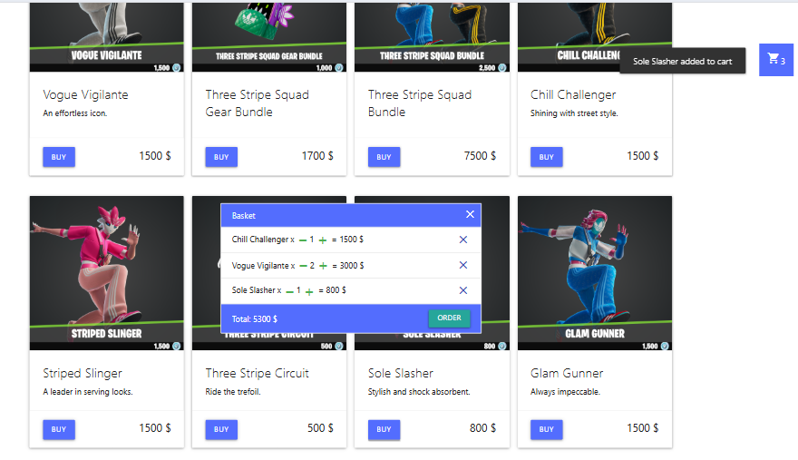

# React + TypeScript + Vite
- [Demo React-shop](avshir.github.io/react-shop-simple/) - simple shop with Cart of order

## Used
- [API - fortniteapi.io](https://fortniteapi.io/) -  for shops, e-commerce, need to get API key, free, several langs
- [Materialize css](https://materializecss.com/) - simple css framework, use CLI, use icons (by link in head)
- use .env.local to keep API_KEY
- get goods from REST API, show list of goods
- add goods to Cart
- Cart with list of order, ability add, delete a good, remove type of a good, Total of the order
- Alert(toast) when a good added to Cart

